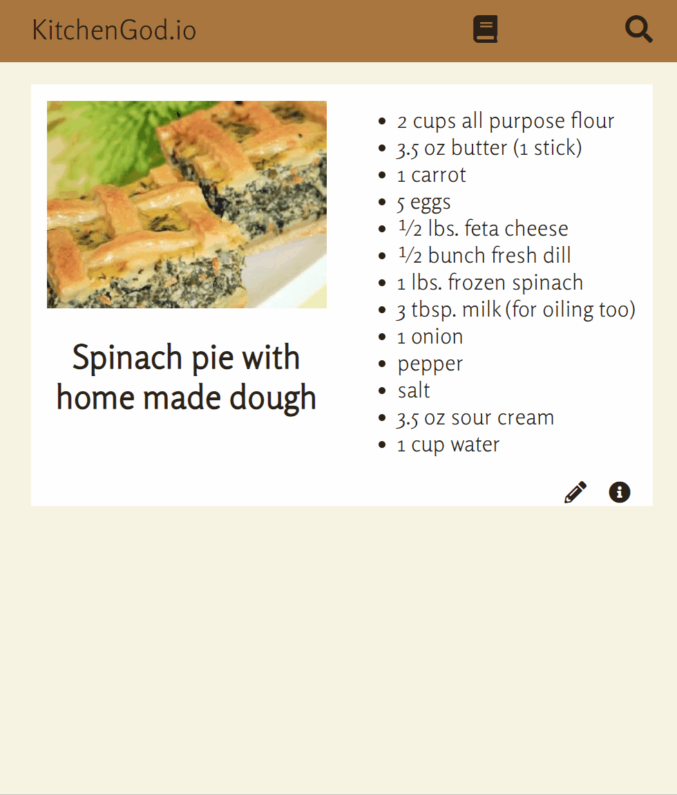

# KitchenGod.io

A web application for people who want to search for, save, and edit recipes.

I wanted to build this app to simplify the process of finding recipes online.
All too often users will search for recipes online and find themselves sifting
through paragraphs of irrelevant backstories behind the recipes when what they want
is a list of ingredients and instructions. The intention behind KitchenGod.io was
to cut out the noise and provide the user with recipes only.

## Technologies Used

- JavaScript
- HTML5
- CSS3
- npm

## Live Demo

Try the application live at [https://ry-zhao.github.io/ajax-project/]

## Features

- User can add new recipes
- User can view their saved recipes
- User can edit recipes
- User can search recipes
- User can copy and save recipes

## Stretch Features

- User can delete recipe
- User can add note to recipes
- User can rearrange items on recipe lists

## Preview




## Development

### System Requirements

-npm 6 or higher

### Getting Started

1. Clone the repository.

    ```shell
    git clone https://github.com/ry-zhao/ajax-project/
    cd ajax-project
    ```

2. Install all dependencies with npm.

    ```shell
    npm install
    ```
